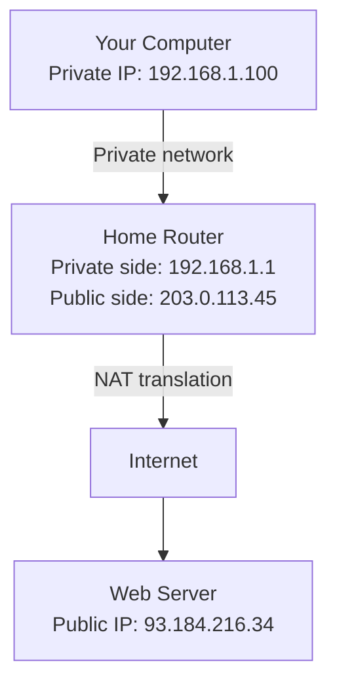
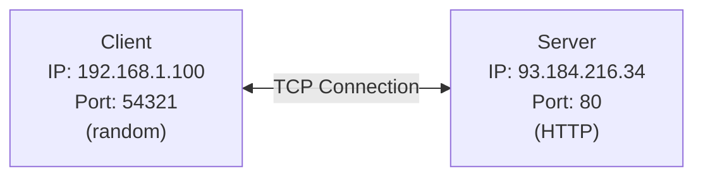
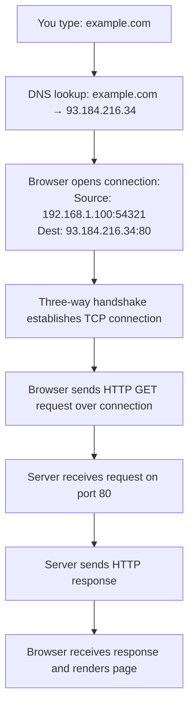

# IP Addresses and Ports

We've talked about the TCP/IP stack and how data flows through layers. Now let's get concrete: how do computers actually find each other on the internet? The answer lies in two fundamental addressing mechanisms: **IP addresses** and **ports**.

Think of it like mailing a letter to an apartment building. The IP address is the building's street address—it gets your letter to the right building. The port number is the apartment number—it gets your letter to the specific resident inside that building.

When you build a web server, you'll bind to an IP address and port. Understanding what these are and how they work together is essential.

## IP Addresses: Finding Computers

An **IP address** is a numerical label assigned to each device on a network. It serves two main purposes:
1. **Identification**: Uniquely identifies a host or network interface
2. **Location addressing**: Provides the location of the device in the network topology

There are two versions of IP in use today: IPv4 and IPv6.

### IPv4: The Original

IPv4 addresses are 32-bit numbers, typically written as four decimal numbers (0-255) separated by dots:

```
192.168.1.1
172.16.0.1
8.8.8.8
```

**Structure**: Each of the four numbers is called an **octet** (because it's 8 bits). Four octets × 8 bits = 32 bits total.

**Total addresses**: 2³² = approximately 4.3 billion addresses.

**The problem**: 4.3 billion sounds like a lot, but with billions of devices online, we ran out of IPv4 addresses years ago. This led to various workarounds (NAT, private addresses) and ultimately to IPv6.

### IPv6: The Future (and Present)

IPv6 addresses are 128-bit numbers, written as eight groups of four hexadecimal digits separated by colons:

```
2001:0db8:85a3:0000:0000:8a2e:0370:7334
2001:db8:85a3::8a2e:370:7334  (shortened form)
::1  (loopback, equivalent to 127.0.0.1 in IPv4)
```

**Total addresses**: 2¹²⁸ = approximately 340 undecillion addresses. That's 340 followed by 36 zeros. We won't run out.

**Adoption**: IPv6 has been slowly rolling out for years. Many modern systems support both IPv4 and IPv6 (dual-stack). As a developer, you should design your applications to work with both.

### Special IP Addresses

Certain IP addresses have special meanings:

**Loopback (localhost)**:
- IPv4: `127.0.0.1`
- IPv6: `::1`
- These addresses always refer to "this computer." When you develop locally and connect to `localhost`, you're using the loopback address.

**Any/All interfaces**:
- IPv4: `0.0.0.0`
- IPv6: `::`
- When a server binds to this address, it listens on all available network interfaces. This is what you typically want for a web server.

**Private (non-routable) addresses**:
- `10.0.0.0/8` (10.0.0.0 to 10.255.255.255)
- `172.16.0.0/12` (172.16.0.0 to 172.31.255.255)
- `192.168.0.0/16` (192.168.0.0 to 192.168.255.255)

These ranges are reserved for private networks and won't be routed over the public internet. Your home router probably assigns addresses in the `192.168.x.x` range.

### Public vs Private Addresses



Your computer probably has a private IP address. When you make a request to a public web server, your router performs **Network Address Translation (NAT)**—it rewrites the source IP address to its public IP before forwarding your packet to the internet. The server responds to your router's public IP, and your router forwards the response back to your private IP.

This is why billions of devices can share 4.3 billion IPv4 addresses—most devices use private addresses and share public IPs through NAT.

## Ports: Finding Services

An IP address gets data to the right computer, but a single computer runs many network services. How does the computer know whether incoming data is for the web server, email server, SSH session, or something else?

That's where **ports** come in.

A **port** is a 16-bit number (0-65535) that identifies a specific process or service on a computer. When combined with an IP address, it forms a complete **socket address** that uniquely identifies a communication endpoint.

### Port Ranges

Ports are divided into three ranges:

**Well-known ports (0-1023)**:
Reserved for common services and typically require administrative privileges to bind to.

| Port | Service | Description |
|------|---------|-------------|
| 20/21 | FTP | File transfer |
| 22 | SSH | Secure shell |
| 23 | Telnet | Unencrypted remote login |
| 25 | SMTP | Email sending |
| 53 | DNS | Domain name resolution |
| 80 | HTTP | Web traffic |
| 110 | POP3 | Email retrieval |
| 143 | IMAP | Email access |
| 443 | HTTPS | Secure web traffic |

**Registered ports (1024-49151)**:
Assigned to specific services but don't require special privileges. Many applications use ports in this range.

| Port | Service |
|------|---------|
| 3000 | Development servers |
| 3306 | MySQL |
| 5432 | PostgreSQL |
| 6379 | Redis |
| 8000 | Common development port |
| 8080 | Alternative HTTP |

**Dynamic/Private ports (49152-65535)**:
Available for temporary use by client applications. When your browser connects to a web server, it typically uses a random port from this range as its source port.

### How IP and Port Work Together

A **socket address** combines an IP address and port:

```
93.184.216.34:80        (IPv4)
[2001:db8::1]:443       (IPv6, note the brackets)
localhost:8000          (hostname with port)
```

When your web server runs, it creates a socket bound to a specific IP address and port, like `0.0.0.0:8000`. This means:
- Listen on all network interfaces (`0.0.0.0`)
- Use port 8000

In Rust, you'll write code like:
```rust
let listener = TcpListener::bind("0.0.0.0:8000")?;
```

### Connection Endpoints

Every TCP connection has two endpoints:



**Client side**: Usually a random high port (ephemeral port)
**Server side**: A well-known port for the service (80 for HTTP, 443 for HTTPS)

The combination of these four values uniquely identifies a connection:
```
(client IP, client port, server IP, server port)
192.168.1.100:54321 → 93.184.216.34:80
```

This is why a web server on port 80 can handle thousands of simultaneous connections—each connection has a different client IP or client port, making it unique.

### Port States and Binding

When you start a server, you **bind** to a port. This tells the operating system: "Any data arriving for this port should be sent to my application."

**Important constraints**:

1. **One process per port**: Only one process can bind to a specific port at a time (generally). If you try to start two web servers on port 8000, the second one will fail with "address already in use."

2. **Privileged ports**: On Unix-like systems, binding to ports below 1024 requires root privileges. This is a security measure—it prevents random users from running fake versions of important services.

3. **Firewall rules**: Even if your application binds successfully, firewalls (OS-level or network-level) might block external access to that port.

## Putting It All Together

Let's trace a complete web request using IP addresses and ports:



Every step involves these addressing mechanisms:
- DNS translates a hostname to an IP address
- TCP uses IP addresses and ports to establish a connection
- The server is listening on a specific port (80)
- The client uses an ephemeral port for its side of the connection


## Practical Implications for Development

When you build and run your web server, you'll make decisions about IP addresses and ports:

**For development**:
```rust
TcpListener::bind("127.0.0.1:8000")  // Only accessible locally
```

**For production**:
```rust
TcpListener::bind("0.0.0.0:8000")  // Accessible from any network interface
```

**Make it configurable**: Rather than hardcoding these values, use environment variables or configuration files:
```rust
let addr = env::var("BIND_ADDRESS").unwrap_or_else(|_| "127.0.0.1:8000".to_string());
TcpListener::bind(addr)
```
This lets you automatically use appropriate settings for different environments without changing code.

**Common issues you'll encounter**:

- **"Address already in use"**: Another process is bound to that port. Find and stop it, or use a different port.
- **"Permission denied" on port 80**: You need elevated privileges or should use a higher port number.
- **Can't connect from another machine**: You bound to `127.0.0.1` (localhost only) instead of `0.0.0.0` (all interfaces).
- **Connection refused**: Server isn't running, wrong port, or firewall is blocking.

## IPv4 vs IPv6 in Practice

When binding a server socket, you can choose:

```rust
// IPv4 only
TcpListener::bind("0.0.0.0:8000")

// IPv6 only (also accepts IPv4 on many systems via IPv4-mapped IPv6)
TcpListener::bind("[::]:8000")

// Explicit IPv6 address
TcpListener::bind("[2001:db8::1]:8000")
```

Most modern systems are dual-stack, meaning they support both IPv4 and IPv6 simultaneously. Binding to `[::]` often enables both, but behavior varies by operating system.

For maximum compatibility in production, consider binding separate sockets for IPv4 and IPv6, or rely on your reverse proxy to handle both and forward to your application over IPv4.

## Looking Forward

Now that we understand IP addresses and ports, we have one more piece of the puzzle: **DNS**. While IP addresses are what computers use, humans prefer memorable names like `google.com` or `github.com`. 

In the next section, we'll explore how the Domain Name System translates human-friendly hostnames into the IP addresses that make connections possible.