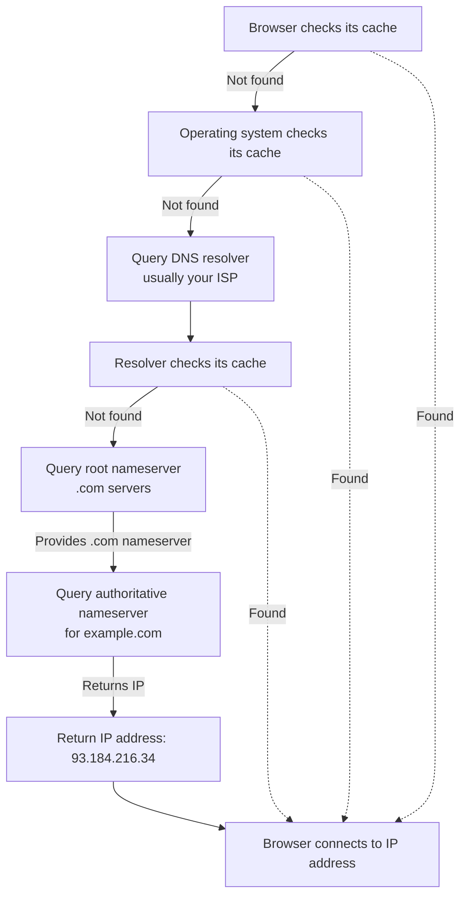

# DNS and Hostnames

We've covered IP addresses and ports—the numeric addressing system that computers use to communicate. But there's a problem: humans are terrible at remembering numbers.

Quick, what's the IP address of your favorite website? You probably don't know. You might not even know your *own* public IP address. But you can easily remember `github.com`, `google.com`, or `wikipedia.org`.

This is where the **Domain Name System (DNS)** comes in. DNS is essentially the phonebook of the internet—it translates human-readable domain names into machine-readable IP addresses. It's one of those services that's so fundamental and ubiquitous that you only notice it when it breaks.

## The Problem DNS Solves

In the early days of ARPANET (the precursor to the internet), there were so few computers that each one maintained a simple text file called `HOSTS.TXT` that mapped hostnames to IP addresses:

```
10.0.0.1    stanford
10.0.0.2    ucla
10.0.0.3    mit
```

This file was manually maintained and periodically downloaded by all computers on the network. As you can imagine, this approach doesn't scale. What happens when you have thousands, millions, or billions of hosts?

DNS was created to solve this scalability problem. Instead of a single central file, DNS is a **distributed, hierarchical database** that can handle billions of records and billions of queries per day.

## How DNS Works: The Resolution Process

When you type `example.com` into your browser, here's what happens behind the scenes:



Let's break down each step:

### 1. Local Caching

Your browser and operating system cache DNS results. If you've visited `example.com` recently, the IP address is probably already cached locally. This is why repeat visits to the same site are faster.

Cached entries have a **TTL (Time To Live)**—typically seconds to hours—after which they expire and must be re-queried.

### 2. DNS Resolver

If there's no local cache hit, your computer sends a query to a **DNS resolver** (also called a recursive resolver). This is usually provided by your ISP, though you can use public resolvers like Google's `8.8.8.8` or Cloudflare's `1.1.1.1`.

The resolver does the heavy lifting of finding the answer.

### 3. Root Nameservers

If the resolver doesn't have the answer cached, it starts at the top of the DNS hierarchy: the **root nameservers**. There are 13 root nameserver addresses (labeled A through M), though each is actually a cluster of many servers distributed globally.

The root nameserver doesn't know the IP for `example.com`, but it knows who handles `.com` domains. It returns the addresses of the `.com` TLD (Top-Level Domain) nameservers.

### 4. TLD Nameservers

The resolver queries the `.com` TLD nameservers, which know about all `.com` domains. They don't know the IP for `example.com` either, but they know which nameservers are **authoritative** for `example.com`.

### 5. Authoritative Nameservers

Finally, the resolver queries the authoritative nameserver for `example.com`. This server has the actual records for the domain and returns the IP address.

### 6. Return and Cache

The resolver returns the IP address to your computer, caching it for future queries. Your OS and browser also cache it. Now your browser can connect to that IP address.

This entire process typically takes milliseconds, and most of the time it's even faster because of caching at various levels.

## The DNS Hierarchy

DNS is organized as a tree structure:

```
                          . (root)
                          |
        +-----------------+-----------------+
        |                 |                 |
       com               org               net
        |                 |                 |
    +---+---+         +---+---+         +---+---+
    |       |         |       |         |       |
 example  google   wikipedia ...      ...     ...
    |
+---+---+
|       |
www    api
```

**Root level (.)**: The top of the hierarchy, managed by 13 organizations worldwide.

**Top-Level Domains (TLDs)**: Like `.com`, `.org`, `.net`, `.edu`, plus country codes like `.uk`, `.ca`, `.jp`.

**Second-level domains**: The part you register—`example` in `example.com`.

**Subdomains**: Additional levels like `www.example.com` or `api.example.com`.

Each level delegates authority to the level below it. The root delegates to `.com`, which delegates to `example.com`, which can create its own subdomains.

## DNS Record Types

DNS doesn't just map names to IP addresses. It stores various types of records:

### A and AAAA Records

**A records** map hostnames to IPv4 addresses:
```
example.com.    300    IN    A    93.184.216.34
```

**AAAA records** (pronounced "quad-A") map hostnames to IPv6 addresses:
```
example.com.    300    IN    AAAA    2606:2800:220:1:248:1893:25c8:1946
```

When you query DNS for a hostname, you're typically getting an A or AAAA record.

### CNAME Records

**CNAME** (Canonical Name) records create aliases. They point one domain name to another:
```
www.example.com.    300    IN    CNAME    example.com.
```

This is useful when multiple hostnames should point to the same place. The browser makes a second query to resolve the canonical name.

### MX Records

**MX** (Mail Exchange) records specify mail servers for a domain:
```
example.com.    300    IN    MX    10 mail.example.com.
```

The number (10) is a priority—lower numbers are tried first.

### NS Records

**NS** (Name Server) records specify which servers are authoritative for a domain:
```
example.com.    300    IN    NS    ns1.example.com.
example.com.    300    IN    NS    ns2.example.com.
```

### TXT Records

**TXT records** store arbitrary text, often used for verification or configuration:
```
example.com.    300    IN    TXT    "v=spf1 include:_spf.example.com ~all"
```

Common uses include SPF (email authentication), domain verification for services, and configuration data.

### SOA Records

**SOA** (Start of Authority) records contain administrative information about the zone, including the primary nameserver and timing parameters.

## DNS in the Real World

### Multiple IP Addresses

A single hostname can resolve to multiple IP addresses:
```
example.com.    300    IN    A    93.184.216.34
example.com.    300    IN    A    93.184.216.35
example.com.    300    IN    A    93.184.216.36
```

This enables **load balancing** and **redundancy**. Your browser will typically pick one at random (or the OS might round-robin between them).

### Geo-DNS

Some DNS providers return different IP addresses based on the geographic location of the requester. This is called **GeoDNS** or **geographic load balancing**.

When you visit `google.com` from Canada, you might get a different IP than someone visiting from Japan. Each IP points to a datacenter closer to that user.

### TTL and Caching

The **TTL** (Time To Live) value in a DNS record specifies how long the record can be cached:

```
example.com.    300    IN    A    93.184.216.34
                ^^^
                TTL in seconds (5 minutes)
```

**Short TTLs** (30-300 seconds): Useful when you might need to change IP addresses quickly, but generates more DNS traffic.

**Long TTLs** (hours or days): Reduces DNS queries but means changes take longer to propagate.

When planning server migrations, administrators often lower TTLs in advance so that when they change the IP address, it propagates quickly.

### DNS Propagation

When you update a DNS record, the change doesn't take effect everywhere instantly. Different resolvers have cached the old value with different TTLs. 

"DNS propagation" refers to the time it takes for updated DNS records to be cached globally. This can range from minutes to days, depending on TTLs and caching behavior.

## DNS from a Developer's Perspective

### Hostname Resolution in Code

When you write networking code in Rust, you typically work with hostnames, not IP addresses directly:

```rust
// Rust's standard library handles DNS for you
let stream = TcpStream::connect("example.com:80")?;
```

Behind the scenes, `connect` performs a DNS lookup to resolve `example.com` to an IP address, then connects to that IP. This is convenient but has implications:

**Blocking**: DNS lookups can take time and will block your thread. In async code, use async DNS resolution.

**Caching**: The OS caches DNS results, but behavior varies by platform.

**Failures**: DNS lookups can fail (network issues, domain doesn't exist, DNS server down). Always handle these errors.

### /etc/hosts

On Unix-like systems (Linux, macOS), the `/etc/hosts` file provides local hostname overrides:

```
127.0.0.1       localhost
127.0.0.1       myapp.local
192.168.1.100   dev-server
```

The OS checks this file *before* querying DNS. This is useful for development—you can map `myapp.local` to `127.0.0.1` and access your local development server with a friendly hostname.

On Windows, it's `C:\Windows\System32\drivers\etc\hosts`.

### localhost

The hostname `localhost` is special—it always resolves to the loopback address:
- IPv4: `127.0.0.1`
- IPv6: `::1`

When developing, you'll often run your server on `localhost:8000`. This hostname doesn't require DNS—it's handled by the OS directly.

### Common DNS Issues

**"DNS_PROBE_FINISHED_NXDOMAIN"**: The domain doesn't exist. Check for typos, or the domain might not be registered.

**"DNS lookup failed"**: Can't reach the DNS server. Check your internet connection or DNS server configuration.

**Slow page loads**: DNS queries can add latency. Connection pooling and DNS caching help mitigate this.

**Stale DNS cache**: You've updated a DNS record but are still getting the old IP. Clear your local DNS cache:
- macOS: `sudo dscacheutil -flushcache`
- Windows: `ipconfig /flushdns`
- Linux: Depends on the system, often `sudo systemd-resolve --flush-caches`

## DNS Security Considerations

**DNS Spoofing**: Attackers can provide false DNS responses, directing users to malicious servers. **DNSSEC** (DNS Security Extensions) helps prevent this by cryptographically signing DNS records.

**DNS Hijacking**: Compromising DNS servers to redirect traffic. Always use trusted DNS resolvers.

**DDoS Attacks**: DNS infrastructure is a common target for distributed denial-of-service attacks.

**Privacy**: DNS queries are traditionally unencrypted, meaning ISPs and others can see what domains you're visiting. **DNS over HTTPS (DoH)** and **DNS over TLS (DoT)** encrypt DNS queries for better privacy.

## Practical Takeaways

As a web developer building servers:

**You don't control DNS**: Users' DNS queries go through their ISPs and resolvers. You control your authoritative nameservers, but caching happens everywhere else.

**DNS adds latency**: The first connection to your server requires DNS resolution. Subsequent requests use cached results.

**Plan for DNS changes**: If you're migrating servers, lower your TTLs beforehand and expect some users to cache the old IP for a while.

**Use hostnames, not IPs**: Hardcoding IP addresses makes it difficult to move or scale your infrastructure. Use hostnames and let DNS handle the mapping.

**Consider redundancy**: Have multiple nameservers (`NS` records) and consider multiple IP addresses (multiple `A` records) for resilience.

## Connection to Web Servers

When you build your web server, DNS is part of the request journey:

1. User types your domain in their browser
2. DNS resolves the domain to your server's IP
3. Browser connects to that IP on port 80 or 443
4. Your server accepts the connection and handles the HTTP request

You control step 3 and 4. DNS (step 2) is mostly out of your hands, but understanding it helps you debug issues and plan infrastructure changes.

## Wrapping Up Part I

We've now covered the fundamental networking concepts you need to build a web server:

- **The OSI Model**: A conceptual framework for understanding network layers
- **TCP/IP Stack**: The actual protocol suite the internet uses
- **IP Addresses and Ports**: How computers and services are identified
- **DNS**: How human-readable names become machine-readable addresses

These concepts form the foundation. In the next part, we'll roll up our sleeves and start working directly with these technologies. We'll explore sockets—the programming interface that lets your code interact with the TCP/IP stack—and build our first TCP server in Rust.

The theory is important, but now it's time to write some code.