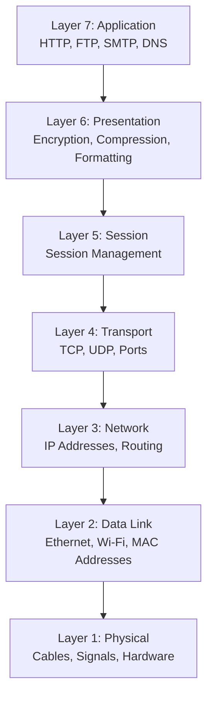
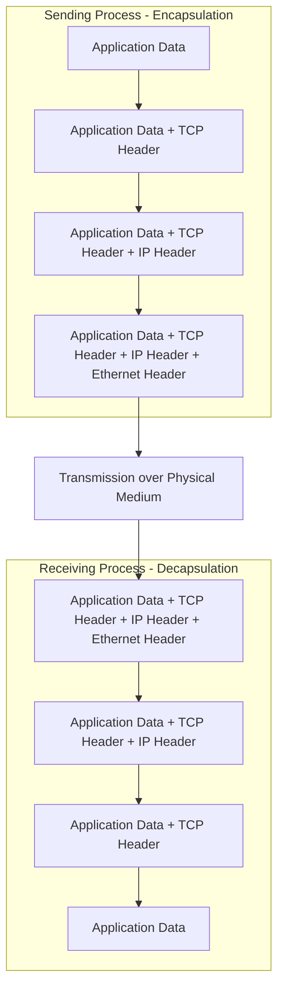

# The OSI Model

The **Open Systems Interconnection (OSI) model** is a conceptual framework that describes how network communication works. Created by the International Organization for Standardization (ISO) in the late 1970s, it divides the complex process of network communication into seven distinct layers, each with specific responsibilities.

Now, here's the truth: the OSI model is somewhat academic. The internet doesn't actually use it—we use TCP/IP instead, which we'll cover in the next section. So why learn about OSI at all?

Because it provides a **mental model** that's invaluable for understanding, discussing, and troubleshooting networks. When an experienced developer says "that's a Layer 7 problem," they're using OSI terminology to quickly convey where an issue lies. The layered thinking that OSI teaches applies to virtually all network protocols, including the ones we actually use.

## The Seven Layers

The OSI model consists of seven layers, numbered from bottom to top. Data flows down through the layers on the sending side, across the network, and then back up through the layers on the receiving side.Let's explore each layer from bottom to top:

### Layer 1: Physical

The **Physical layer** deals with the raw transmission of bits over a physical medium. This is the realm of cables, wireless signals, voltage levels, and hardware specifications.

Examples: Ethernet cables, fiber optics, radio frequencies, USB connections

When you think about the Physical layer, think about the actual hardware that carries the electrical or light signals representing your data.

### Layer 2: Data Link

The **Data Link layer** handles communication between devices on the same local network. It's responsible for framing data into packets, physical addressing (MAC addresses), and error detection.

Examples: Ethernet, Wi-Fi (802.11), switches

This layer ensures that data can be reliably transmitted between two devices that are directly connected or on the same local network segment.

### Layer 3: Network

The **Network layer** handles routing data across different networks. This is where IP addresses live, and where decisions are made about how to get data from source to destination across multiple networks.

Examples: IP (Internet Protocol), routers, ICMP

When you send data to a server halfway around the world, the Network layer is responsible for finding a path through the maze of interconnected networks.

### Layer 4: Transport

The **Transport layer** provides end-to-end communication services. It handles segmentation, flow control, error correction, and ensures data arrives in the correct order.

Examples: TCP (reliable, connection-oriented), UDP (unreliable, connectionless)

This is the first layer that deals with end-to-end communication rather than hop-by-hop. When we build our web server, we'll work directly with TCP at this layer.

### Layer 5: Session

The **Session layer** manages sessions or connections between applications. It establishes, maintains, and terminates connections, and can handle authentication and reconnection.

Examples: Session management in RPC, NetBIOS

In practice, this layer is often merged with other layers in real implementations, which is one reason why the OSI model differs from reality.

### Layer 6: Presentation

The **Presentation layer** handles data format translation, encryption, and compression. It ensures that data sent by one system can be read by another, even if they use different internal representations.

Examples: SSL/TLS encryption, JPEG, ASCII, EBCDIC conversion

Like the Session layer, this is often merged with application-layer protocols in practice.

### Layer 7: Application

The **Application layer** is where user-facing protocols and services live. This is the layer that applications directly interact with.

Examples: HTTP, FTP, SMTP, DNS, SSH

When you're building a web server, you're primarily working at this layer—implementing the HTTP protocol that browsers use to request web pages.

## Encapsulation: Data's Journey Through the Layers

Here's how data flows through the OSI model when you send a message:

1. **Application Layer**: You make an HTTP request in your browser
2. **Presentation Layer**: The data might be encrypted (HTTPS)
3. **Session Layer**: A session is managed
4. **Transport Layer**: TCP breaks it into segments, adds port numbers
5. **Network Layer**: IP adds source and destination IP addresses
6. **Data Link Layer**: Ethernet adds MAC addresses and creates frames
7. **Physical Layer**: Bits are transmitted over the wire

Each layer adds its own **header** (and sometimes trailer) to the data, a process called **encapsulation**. On the receiving end, each layer removes its corresponding header, a process called **decapsulation**.

## Why Layers Matter

The beauty of the layered approach is **separation of concerns**. Each layer has a specific job and doesn't need to know the details of other layers:

- The Application layer doesn't care whether it's running over Ethernet or Wi-Fi
- The Network layer doesn't care whether you're using TCP or UDP
- The Physical layer doesn't care what data you're sending

This separation allows different technologies to be mixed and matched. You can run HTTP over TCP over IP over Ethernet, or HTTP over TCP over IP over Wi-Fi—the upper layers don't need to change.

## Limitations of the OSI Model

While the OSI model is useful for understanding concepts, it has limitations:

- **It's theoretical**: The internet was built on TCP/IP, not OSI
- **Layers blur**: In practice, functionality doesn't always map cleanly to specific layers
- **It's complex**: Seven layers is arguably more than necessary

The OSI model was designed by committee to be comprehensive and universal. Meanwhile, TCP/IP emerged organically from practical needs and actual implementation. TCP/IP won.

## Practical Takeaway

When debugging or designing network applications, think in terms of layers:
- "Is this a connectivity problem?" (Layers 1-3)
- "Is this a protocol problem?" (Layer 4)
- "Is this an application logic problem?" (Layer 7)

This mental model helps you isolate problems and communicate with other developers effectively.

In the next section, we'll look at the TCP/IP stack—the protocol suite that actually powers the internet—and see how it differs from the OSI model.
