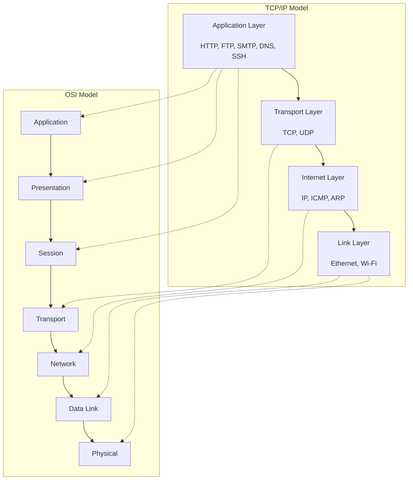
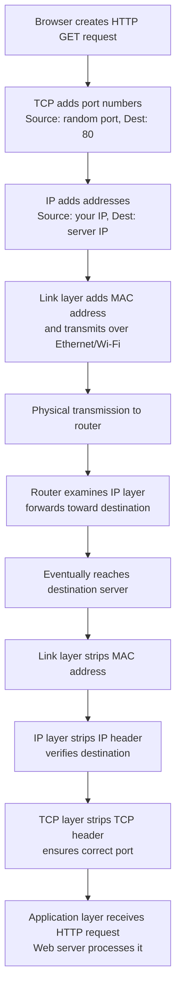

# TCP/IP Stack

In the last section, we learned about the OSI model—a comprehensive, seven-layer framework for understanding networks. Now let's look at what the internet *actually* uses: the TCP/IP protocol suite.

TCP/IP (Transmission Control Protocol/Internet Protocol) is the foundation of the internet. While the OSI model was designed by committee in conference rooms, TCP/IP emerged from ARPANET, the precursor to the internet, through practical experimentation and real-world use. It's scrappier, simpler, and ultimately more pragmatic than OSI.

When you build a web server, you're building on top of TCP/IP. Understanding this stack isn't optional—it's the actual architecture your code runs on.

## Why TCP/IP Won

The "protocol war" of the 1980s and early 1990s pitted TCP/IP against OSI and other competing standards. TCP/IP won decisively for several reasons:

**It was already deployed**: By the time OSI was formally standardized, TCP/IP was already running on ARPANET and had years of real-world testing and refinement.

**It was simpler**: Four layers instead of seven meant less complexity and less overhead. The missing layers from OSI (Session and Presentation) weren't abandoned—their functionality just got absorbed into other layers or implemented at the application level when needed.

**It was open and free**: The TCP/IP specifications were publicly available, while many OSI implementations came with licensing restrictions.

**It worked**: TCP/IP was designed by engineers solving actual problems, not by committees trying to create a universal standard. Pragmatism won.

## The Four Layers

The TCP/IP model consists of four layers. Let's see how they map to what we learned about OSI:

### Layer 4: Application Layer

The **Application Layer** is where network applications and their protocols live. This layer combines the functionality of OSI's Application, Presentation, and Session layers into one.

**What it does**:
- Defines protocols that applications use to communicate
- Handles data formatting, encryption, and session management when needed
- Provides services directly to user applications

**Key protocols**:
- **HTTP/HTTPS**: Web browsing (what we'll implement)
- **FTP**: File transfer
- **SMTP**: Email sending
- **POP3/IMAP**: Email retrieval
- **DNS**: Domain name resolution
- **SSH**: Secure remote access

When you write a web server, you're working at this layer. You'll receive HTTP requests and send HTTP responses, but the layers below handle getting those bytes from point A to point B.

### Layer 3: Transport Layer

The **Transport Layer** provides end-to-end communication services. It's responsible for breaking data into manageable segments, ensuring reliability (if using TCP), and managing flow control.

**What it does**:
- Segments data for transmission
- Provides port numbers to distinguish different services
- Offers reliability and ordering (TCP) or speed (UDP)
- Controls flow to prevent overwhelming receivers

**Key protocols**:
- **TCP (Transmission Control Protocol)**: Reliable, ordered, connection-oriented. Used for HTTP, email, file transfer—anything that needs guaranteed delivery.
- **UDP (User Datagram Protocol)**: Fast, connectionless, no guarantees. Used for DNS queries, video streaming, gaming—anything that values speed over perfection.

We'll focus heavily on TCP since HTTP runs on top of it. Understanding TCP's guarantees helps explain why HTTP works the way it does.

### Layer 2: Internet Layer

The **Internet Layer** handles routing data across networks. This is where IP addresses live, and where packets are routed from source to destination across multiple networks.

**What it does**:
- Addresses packets with source and destination IP addresses
- Routes packets across network boundaries
- Fragments and reassembles packets when needed
- Handles basic error reporting

**Key protocols**:
- **IP (Internet Protocol)**: The core protocol. Comes in two versions—IPv4 (still dominant) and IPv6 (gradually being adopted).
- **ICMP (Internet Control Message Protocol)**: Error messages and diagnostics (like `ping`).
- **ARP (Address Resolution Protocol)**: Maps IP addresses to MAC addresses on local networks.

The Internet layer is *connectionless*—each packet is independent. If you need reliability, that's TCP's job at the layer above.

### Layer 1: Link Layer

The **Link Layer** (also called the Network Interface or Network Access layer) handles the physical transmission of data over a specific network medium. This combines OSI's Data Link and Physical layers.

**What it does**:
- Moves data between devices on the same physical network
- Handles MAC addresses for local delivery
- Deals with the specific physical medium (Ethernet, Wi-Fi, etc.)
- Manages hardware-level communication

**Examples**:
- Ethernet
- Wi-Fi (802.11)
- PPP (Point-to-Point Protocol)
- Device drivers and network interface cards

As an application developer, you rarely interact directly with this layer—the operating system handles it for you.

## Data Flow: A Web Request

Let's trace what happens when your browser requests a web page:

Each layer adds information on the way down (encapsulation) and removes it on the way up (decapsulation). The middle layers (routers and switches) only look at the headers they need—a router doesn't care about your HTTP request, only about the IP addresses.

## Key Differences from OSI

Let's be explicit about how TCP/IP differs from OSI:

**Fewer layers**: Four instead of seven. The Session and Presentation layers aren't separate—their functionality is either built into applications or handled by libraries.

**Born from implementation**: OSI was designed top-down as a standard. TCP/IP evolved bottom-up from working code.

**Flexibility at the application layer**: Application-layer protocols in TCP/IP can handle encryption, compression, and session management however they want. HTTP does it differently than SSH, and that's fine.

**Focus on internetworking**: The name says it all—the Internet Protocol layer is designed specifically for connecting different networks together.

## Why This Matters for Web Development

When you're building a web server in Rust, you're interacting with multiple layers:

**Application Layer**: You parse HTTP requests and generate HTTP responses.

**Transport Layer**: You create TCP sockets. Rust's `std::net::TcpListener` and `std::net::TcpStream` give you access to TCP directly.

**Lower layers**: The operating system handles these for you, but understanding them helps you debug connection issues, understand performance characteristics, and make better architectural decisions.

For example, knowing that TCP guarantees ordered delivery explains why a single slow HTTP request can block others on the same connection (head-of-line blocking). Understanding that IP packets can take different routes explains network latency variations. Recognizing that the Link layer has an MTU (Maximum Transmission Unit) explains why large packets get fragmented.

## Practical Implications

Here are some practical takeaways for a developer:

**TCP is reliable but has overhead**: When you use TCP, you get guarantees about delivery and ordering. But that reliability costs latency and bandwidth. For HTTP, this trade-off makes sense.

**Port numbers matter**: The Transport layer uses ports to distinguish services. Your web server will listen on port 80 (HTTP) or 443 (HTTPS). We'll work directly with ports when we create our TCP listener.

**IP routing is transparent**: You don't control how packets get from point A to point B. The Internet layer handles routing dynamically. This is usually great, but it means network paths can change mid-connection.

**The stack is just an abstraction**: In reality, layers interact in messy ways. TCP/IP implementations in operating systems take shortcuts and optimizations. But the mental model still helps.

## Looking Ahead

Now that we understand the protocol stack, we can dig into the details that matter most for building a web server:

- **IP addresses and ports**: How do we identify services on the network?
- **DNS**: How do human-readable names become IP addresses?
- **TCP connections**: How do we establish reliable communication channels?

In the next section, we'll explore IP addresses and ports—the addressing system that makes everything possible.
